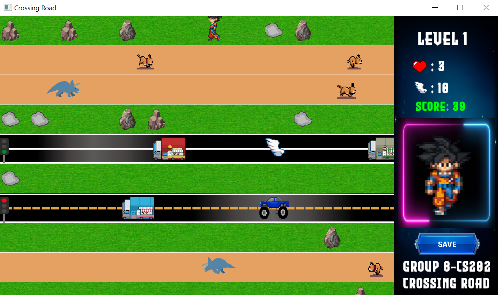

# Crossing-Road
This is the Crossing Road game created by group 8 - CS202 - 21APCS1

## Members
- Tuan-Viet Tran (21125029)
- Mai-Vinh Nguyen (21125031)
- Thien-Phuc Tran (21125090)
- Nghiem Diep Tuong (21125155)

## Project Description
The game is coded in C++17 using the multimedia library [SFML 2.5.1](https://www.sfml-dev.org/index.php).

In this game, our character loves his crush. However, she does not like him, so he would like to collect 7 dragon balls to have a wish that his crush will love him. This is extremely challenging to him because he needs to overcome 7 levels to collect enough dragon balls (each level has 1 dragon ball)

He cannot fly, so he need to walk to cross the road in each level to collect dragon ball. In each level, there are some obstacles which can kill him or hinder him from coming to the goal such as vehicles, rocks or animals.

Fortunately, in the process of crossing roads, he can get some items which can increase his life or his speed
* Heart: to increase character's life
* Wing: to increase character's speed

Character needs user's helps to safety cross the roads of each level to collect enough dragon balls to let his crush love him.

## Getting Started
### Installing
* Clone the project to your computer. 
```
  git clone https://github.com/ttviet2805/Crossing-Road.git
```
* Set up [SFML Library](https://www.sfml-dev.org/tutorials/2.5/start-vc.php).

### Executing program
* Using an IDE to compile this game (Codeblocks, Visual Studio, ...)
* Remember to add all source codes to project before building and running

## Usage
* Game Menu Screen
<div align = "center">
  
</div>

* Select Character Screen
<div align = "center">
  
</div>

* Crossy Road Screen
<div align = "center">
  
</div>

* Leaderboard Screen
<div align = "center">
  
</div>

## Contact
Tran Tuan Viet - ttviet2805@gmail.com
